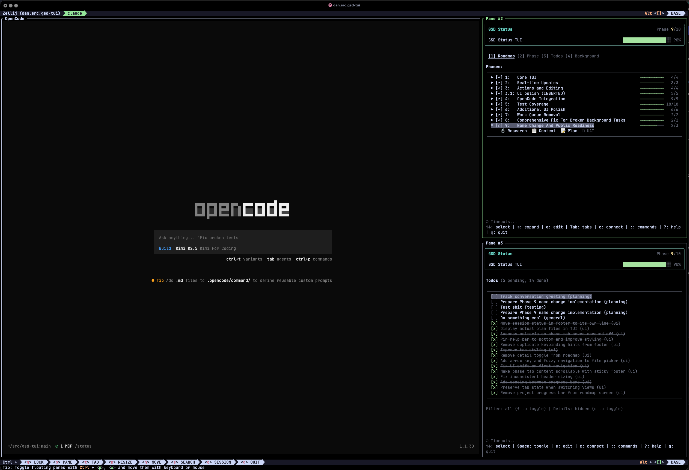

# GSD Console

```
   ____   ____    ____       ____                            _
  / ___| / ___|  |  _ \     / ___|  ___   _ __   ___   ___  | |  ___
 | |  _  \___ \  | | | |   | |     / _ \ | '_ \ / __| / _ \ | | / _ \
 | |_| |  ___) | | |_| |   | |___ | (_) || | | |\__ \| (_) || ||  __/
  \____| |____/  |____/     \____| \___/ |_| |_||___/ \___/ |_| \___|
```

Terminal UI for viewing GSD project status



[](https://www.npmjs.com/package/gsd-console)
[](https://opensource.org/licenses/MIT)

## Features

- Real-time roadmap and phase tracking
- Vim-style keyboard navigation (j/k, gg/G, Ctrl+d/u)
- File watching with live updates
- OpenCode integration for coding agents
- Command palette with fuzzy search
- Background job queue for headless execution

## Compatibility

**Works with any GSD `.planning/` directory.** If you have a project using the [GSD workflow](https://github.com/glittercowboy/get-shit-done), this TUI will display its roadmap, phases, and todos with live updates as files change.

**For coding agent integration**, GSD Console supports [OpenCode](https://github.com/sst/opencode). With OpenCode installed, you can:
- Spawn OpenCode sessions directly from the TUI
- Queue GSD commands for sequential execution
- Connect to existing OpenCode sessions

Without OpenCode, the TUI works as a standalone viewer -- you can still execute GSD CLI commands and edit planning files in your `$EDITOR`.

## Installation

### Prerequisites

- **Bun** (required) -- [install Bun](https://bun.sh/)
- **OpenCode** (optional) -- [install OpenCode](https://opencode.ai/) for coding agent integration

### From npm

```bash
bun install -g dbachdlder/gsd-console
```

### From Source

```bash
git clone https://github.com/dbachelder/gsd-console.git
cd gsd-console
bun install
bun install -g .
```

## Quick Start

```bash
# Navigate to a project with a .planning/ directory
cd my-gsd-project

# Launch the TUI
gsd-console
```

## Usage

```bash
# Full TUI with tabs
gsd-console

# Roadmap view only (great for tmux panes)
gsd-console --only roadmap

# Phase detail view
gsd-console --only phase -p 2

# Todos view only
gsd-console --only todos
```

### CLI Options

| Flag | Short | Description |
|------|-------|-------------|
| `--only <view>` | `-o` | Show only one view (roadmap, phase, todos) |
| `--phase <num>` | `-p` | Phase number for `--only phase` mode |
| `--dir <path>` | `-d` | Path to .planning directory |
| `--help` | `-h` | Show help |

## Keyboard Shortcuts

| Key | Action |
|-----|--------|
| `Tab` | Switch between tabs |
| `1/2/3/4` | Jump to Roadmap/Phase/Todos/Background tab |
| `j/k` | Navigate up/down (Vim-style) |
| `gg/G` | Jump to top/bottom |
| `Ctrl+d/u` | Page down/up |
| `Enter` | Expand/collapse or select |
| `:` | Open command palette |
| `c` | Connect to OpenCode session |
| `e` | Open in external editor |
| `q` | Quit |
| `?` | Show help |

## OpenCode Integration

GSD Console integrates with OpenCode for coding agent execution.

### Architecture

| Component | Description |
|-----------|-------------|
| `opencode` | Standalone TUI, no HTTP API |
| `opencode serve --port 4096` | Headless server with HTTP API |
| `opencode attach http://localhost:4096` | TUI connected to server |

### Connecting for Primary Mode

To execute commands via the "primary" mode (sending prompts to a connected TUI session):

1. **Start the OpenCode server:**
   ```bash
   opencode serve --port 4096
   ```

2. **Attach the TUI to the server:**
   ```bash
   opencode attach http://localhost:4096
   ```

3. **Now API commands appear in the TUI** -- both use the same server

### Execution Modes

| Mode | What it does |
|------|--------------|
| Headless | Adds to background job queue, runs via SDK |
| Interactive | Spawns `opencode attach` with initial prompt |
| Primary | Sends prompt to connected session via SDK |

### Configuring Default Model

Background jobs use OpenCode's default model setting. Configure in `~/.opencode/opencode.json`:

```json
{
  "defaultModel": "glm-4.7"
}
```

## Development

```bash
# Run with hot reload
bun run dev

# Type checking
bun run typecheck

# Linting
bun run lint

# Auto-fix lint issues
bun run lint:fix

# Run tests
bun test

# Run tests with coverage
bun run test:coverage
```

### For Development

Use `bun link` to run `gsd-console` from anywhere while using the local source code:

```bash
bun link
```

To unlink: `bun unlink`

## Contributing

See [CONTRIBUTING.md](CONTRIBUTING.md) for development setup and contribution guidelines.

## License

[MIT](LICENSE)
